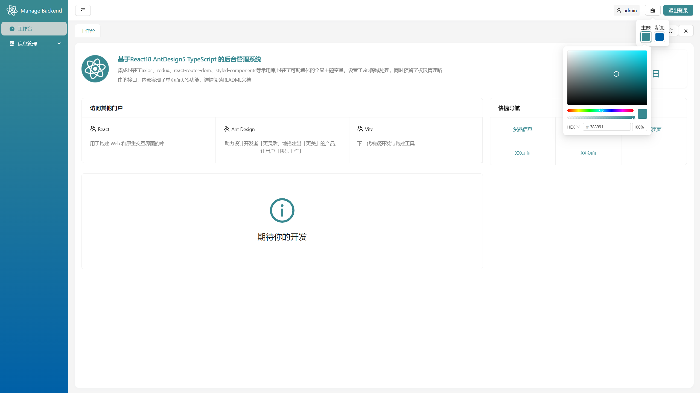

# 安装方法

```javascript
确定你已经安装了node,版本16及以上
在项目根目录打开命令终端
运行指令npm install 或者 pnpm install
安装完成后运行npm run dev 或者 pnpm run dev可运行项目
登录页面开放 随意填入账号密码即可登录
```

# **项目介绍**

该项目是基于react18 typescript，由vite创建的集成了基础功能的纯净后台项目，方便快速上手开发自己业务专属的管理中后台系统

# 项目截图


# 项目特点

集成封装了axios、redux、react-router-dom、styled-components等常用库,封装了主题色变更组件，设置了vite跨域处理，同时预留了权限管理路由的接口，内部实现了单页面页签功能

本项目推荐使用css in js写法，内置了styled-components库

### 封装了hooks用法的状态管理工具redux

```typescript
export const store = configureStore({ reducer: { tab, routes } });

// 全局定义 dispatch和state的类型
export type RootState = ReturnType<typeof store.getState>;
export type AppDispatch = typeof store.dispatch;
// 后面使用过程中直接从该文件中引入,而不需要冲react-redux包中引入
export const useAppDispatch: () => AppDispatch = useDispatch;
export const useAppSelector: TypedUseSelectorHook<RootState> = useSelector;
```

### 对hooks用法的react-router6版本的封装

封装了路由守卫

```typescript
export const BeforeRouter = () => {
  const [isLogin, setIsLogin] = useState(true);
  const { pathname } = useLocation();
  const token = Cookies.get("TOKEN_KEY")
  useEffect(() => {
    token? setIsLogin(true) : setIsLogin(false);
  }, [pathname,token]);
  return isLogin ? <Outlet /> : <Navigate to="/login" />;
};
```

支持传入路由表计算返回虚拟dom的高阶组件

```typescript
const generRoutes = (routes: RouteRecord[]) => {
  return routes.map((route) => {
    return (
      <Route key={route.path} path={route.path} element={route.element}>
        {route.children ? generRoutes(route.children) : undefined}
      </Route>
    );
  });
};
export default function Router() {
  const { list } = useAppSelector((state) => state.routes);
  const dispatch = useAppDispatch();
  const [routes, setRoutes] = useState<RouteRecord[]>([]);
  useEffect(() => {
    dispatch({ type: "routes/setLoading", payload: true });
    setRoutes(filterRoutes(routesProps, list));
    dispatch({ type: "routes/setLoading", payload: false });
  }, [list]);
  return (
    <BrowserRouter>
      <Routes>
        <Route element={<Login />} path="/login"></Route>
        <Route element={<BeforeRouter />}>{generRoutes(routes)}</Route>
        <Route element={<NonExistent />} path="*"></Route>
      </Routes>
    </BrowserRouter>
  );
}
```

### 内部实现了keepAlive功能，并且集成了可拖拽的页签功能

```typescript
<Tabs
      style={{marginTop:10}}
      type={tabsType}
      hideAdd
      className={className}
      items={items}
      activeKey={activeTab}
      onEdit={onEdit}
      onChange={tabChange}
      tabBarExtraContent={renderExtraContent()}
      renderTabBar={(tabBarProps, DefaultTabBar) => (
        <DndContext sensors={[sensor]} onDragEnd={onDragEnd}>
          <SortableContext
            items={items.map((i) => i.key)}
            strategy={horizontalListSortingStrategy}
          >
            <DefaultTabBar {...tabBarProps}>
              {(node) => (
                <DraggableTabNode
                  {...node.props}
                  key={node.key}
                  onActiveBarTransform={setClassName}
                >
                  {node}
                </DraggableTabNode>
              )}
            </DefaultTabBar>
          </SortableContext>
        </DndContext>
      )}
    />
```

### 封装了Axios，支持传入泛型

```typescript
const request= <T>(options:AxiosRequestConfig): Promise<Response<T>>=>{
  return createAxios(options);
}
export default request;
```

### 支持主题颜色随心所欲的变更

```typescript
<Popover
      trigger="click"
      content={
        <Row justify={"center"} align={"middle"}>
          <Space>
            <ColorCol>
              <span>主题</span>
              <ColorPicker
                value={color}
                onChange={(_, hex) =>
                  dispatch({ type: "theme/changeColor", payload: hex })
                }
              />
            </ColorCol>
            <ColorCol>
              <span>渐变</span>
              <ColorPicker
                value={gradient}
                onChange={(_, hex) =>
                  dispatch({ type: "theme/changeGradient", payload: hex })
                }
              />
            </ColorCol>
          </Space>
        </Row>
      }
    >
      <Button>
        <ClearOutlined />
      </Button>
    </Popover>
```

# 目录结构

* src -----主文件目录
  * api -----接口文件
  * assets  -----静态资源
  * components -----组件
  * Layout -----布局相关组件
  * pages -----页面文件
    * 页面名
      * index.tsx ----页面组件
      * xxx.tsx -----用于该页面一些组件
  * router -----路由相关
    * guard -----守卫高阶组件
    * index.d -----路由相关类型定义
    * index -----路由主文件，向外暴露Router组件
    * routes -----本地路由表和一些路由处理方法
  * store -----状态管理库（本项目使用的redux)
  * style -----样式
    * global -----全局样式和自定义的样式组件（css in js)
    * theme -----全局主题变量，用于配置antd的统一token和一些全局公用样式变量
  * types -----统一管理类型文件
  * utils -----存放工具类、第三方库的封装
  * App -----根组件
  * main -----项目渲染主文件
